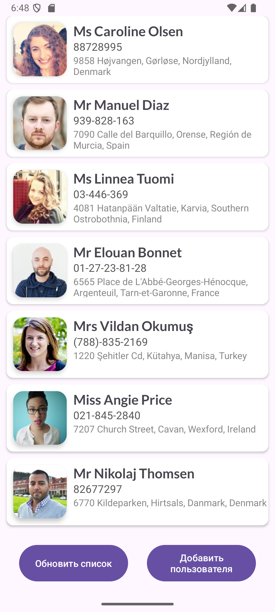
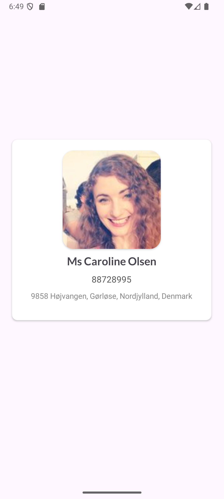

# RandomUserApp (Android)

Мобильное приложение на Kotlin для получения, отображения и управления списком случайных пользователей из [randomuser.me](https://randomuser.me/). Использует современные архитектурные подходы и технологии Jetpack.

## Особенности приложения

- **Экран списка пользователей:** отображение пользователей с фотографией, ФИО, телефоном и адресом.
- **Экран деталей пользователя:** показ полной информации по каждому пользователю (клик по элементу списка).
- **Добавление и обновление пользователей:** выгрузка новых данных из API, обновление локальной информации.
- **Удаление и обновление отдельного пользователя:** swipe-жесты в списке.
- **Сохранение данных:** локальное хранение пользователей в базе SQLite через Room.
- **Интеграция с системными функциями:** вызов по телефону, просмотр локации на карте через соответствующие интенты.
- **Обработка ошибок и состояния загрузки:** уведомления о статусе и возможных ошибках, прогресс-бары, блокировка UI во время операций.

## Архитектура и основные компоненты

- **MVVM:** разделение логики и UI через ViewModel (`UserViewModel`), фабрику (`UserViewModelFactory`).
- **Repository:** слой абстракции для работы с данными (`UserRepository`, `UserRepositoryImpl`).
- **Retrofit:** получение данных по сети (`RandomUserApi`, `RetrofitInstance`).
- **Room:** хранение и управление пользовательскими данными (`UserEntity`, `UserDao`, `UserDb`).
- **UI:** использование RecyclerView и адаптеров для списка, активити для отображения информации (`MainActivity`, `UserAdapter`, `UserDetailActivity`).

## Технологический стек

|Библиотека|Описание|Почему выбрал|
|--|--|--|
|androidx-core-ktx|Базовые функции Android|Необходимое ядро проекта|
|androidx.lifecycle-livedata, viewmodel|Обработка состояния и архитектура|Рекомендуемый Jetpack стиль|
|Room|Локальная база данных|Лёгкое хранение, интеграция с Flow|
|Retrofit + Gson converter|Работа с REST API|Отраслевой стандарт|
|Glide|Загрузка изображений|Быстрое кеширование и загрузка фото|
|Kotlin Coroutines|Асинхронность|Управление фоновыми задачами|
|Material Components|Современный дизайн|Соответствие гайдлайнам Google|

## Пользовательский интерфейс

- Главный экран реализован на основе `ConstraintLayout` с `RecyclerView`, двумя кнопками и прогресс-индикатором.  
- Экран деталей пользователя использует `CardView` и `LinearLayout` для показа фото и данных пользователя.  
- Элементы списка — карточки с фото и текстом, размещённые с помощью `CardView` и `LinearLayout`.  
- Интерфейс адаптивен к разным устройствам и экранам.

## Скриншоты

  
  

## Поток данных

1. Получение данных с randomuser.me через Retrofit.  
2. Кэширование и сохранение пользователей с Room.  
3. Отображение через ViewModel и LiveData с использованием RecyclerView.  
4. Добавление, обновление и удаление пользователей с обработкой ошибок и уведомлениями.

## Почему этот проект?

Демонстрирует:  
- Реализацию архитектуры MVVM с четким разделением ответственности  
- Современные практики Android-разработки с использованием Jetpack-компонентов  
- Эффективную работу с сетью и локальным хранением данных через Retrofit и Room  
- Обработку ошибок и управление состояниями, готовую к применению в реальных приложениях

## Выводы

RandomUserApp — это хорошо структурированное, современное Android-приложение, которое иллюстрирует использование ключевых технологий и практик. Проект подходит как основа для дальнейшего развития и демонстрации навыков при поиске работы или презентации портфолио.

---
